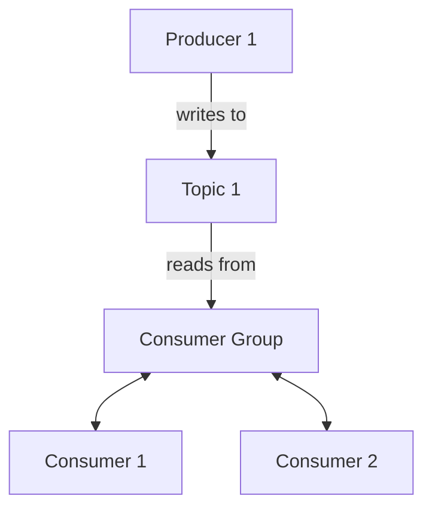

# 선착순 이벤트 시스템

## 요구사항
 - 선착순 100명에게 할인 쿠폰 제공
 - 순간적으로 몰리는 트래픽을 버틸 수 있어야됨
 - 쿠폰이 정상적으로 100개만 지급

# 카프카 기초



```shell
docker exec -it kafka kafka-topics.sh --bootstrap-server localhost:9092 --create --topic coupon.create
docker exec -it kafka kafka-console-producer.sh --topic coupon.create --broker-list 0.0.0.0:9092

# 컨슈머 커맨드 생성 후
docker exec -it kafka kafka-console-consumer.sh --topic coupon.create --bootstrap-server localhost:9092
```